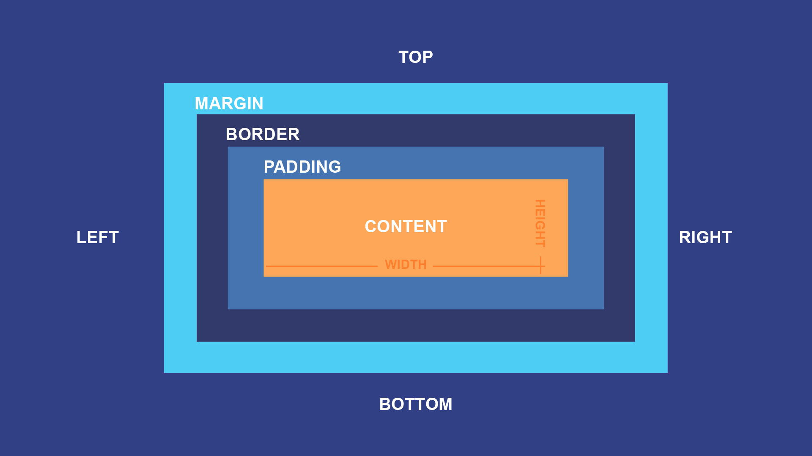
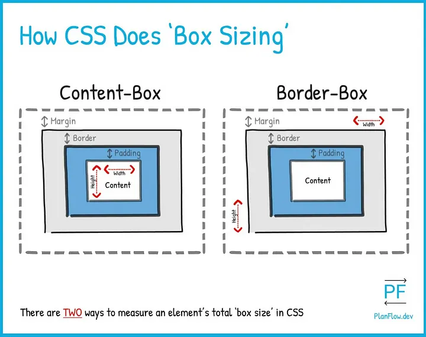

[thksTo](https://www.youtube.com/watch?v=0hrJGWrCux0&ab_channel=EdRoh)

[github_code](https://github.com/ed-roh/master-css)

[miro.com](https://miro.com/app/board/uXjVLA9ELGY=/)

[flexbox_cheat_sheet_2](https://flexbox.malven.co/)

[grid_cheat_sheet](https://grid.malven.co/)

[cssmatic](https://www.cssmatic.com/)

[::before](https://developer.mozilla.org/en-US/docs/Web/CSS/::before)

[:focus](https://developer.mozilla.org/en-US/docs/Web/CSS/:focus)

[:hover](https://developer.mozilla.org/en-US/docs/Web/CSS/:hover)

[css object-fit](https://developer.mozilla.org/en-US/docs/Web/CSS/object-fit)

[grid properties for columns and rows](https://css-tricks.com/auto-sizing-columns-css-grid-auto-fill-vs-auto-fit/)

[grid template areas](https://css-tricks.com/almanac/properties/g/grid-template-areas/)

[css position property](https://developer.mozilla.org/en-US/docs/Web/CSS/position)
